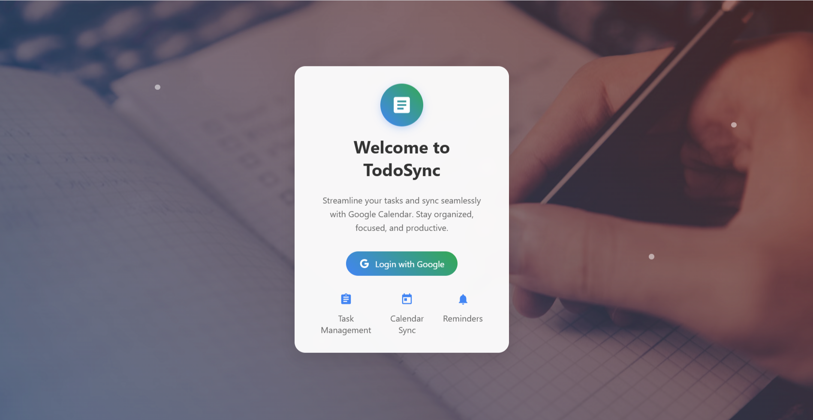
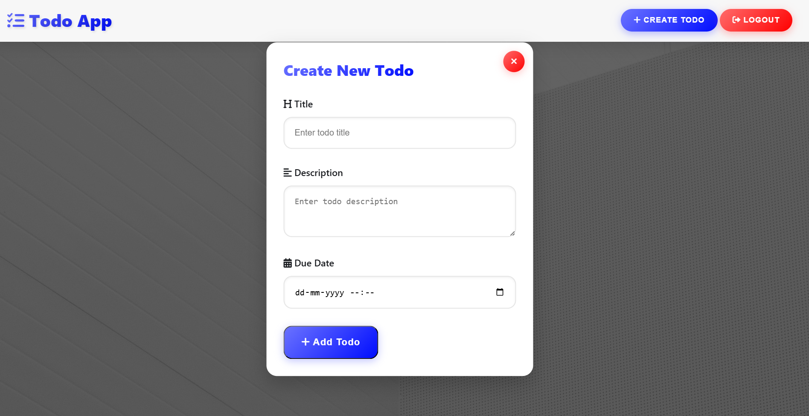
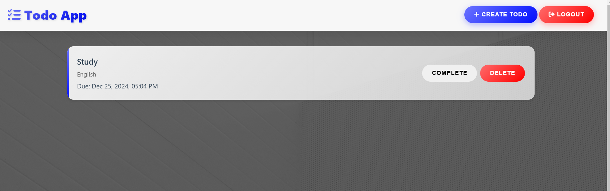
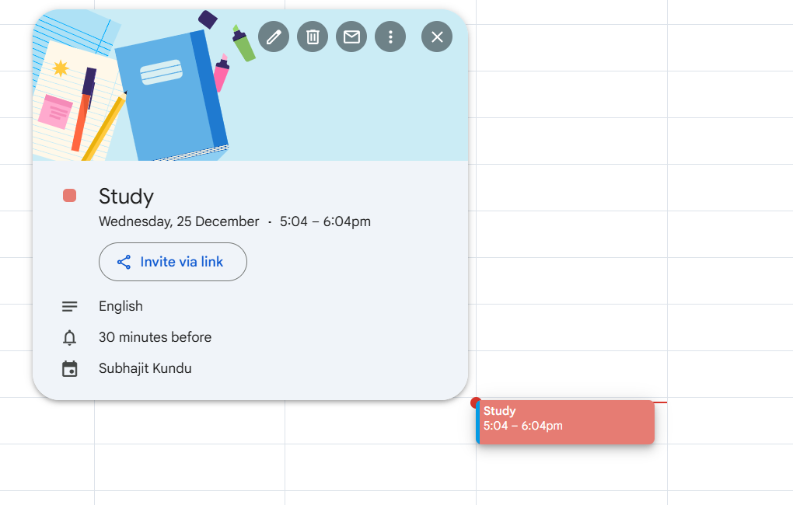

# To-Do App with Google Calendar Integration

## Overview

This is a simple and efficient **To-Do App** built using Python Flask, PostgreSQL, and a modern HTML/CSS/JavaScript frontend. The app enables users to manage their tasks effectively, authenticate with their Google account, and sync tasks with Google Calendar for seamless organization.

## Features

- **User Authentication**: Google OAuth 2.0 is used for secure and seamless login.
- **Task Management**: Add, edit, delete, and mark tasks as complete.
- **Google Calendar Integration**: Sync your tasks with Google Calendar for timely reminders.
- **Responsive Design**: The app is fully responsive and works well on both desktop and mobile devices.
- **Database**: PostgreSQL is used to store user data and tasks securely.

## Technologies Used

### Backend:
- **Python Flask**: Backend framework for building the application.
- **PostgreSQL**: Database management system.
- **Google APIs**: Integrated Google Calendar and Google OAuth for authentication.

### Frontend:
- **HTML, CSS, JavaScript**: To create a modern and responsive user interface.

## Screenshots
# login-page

# Create TODO

# show Tasklist

# update calendar



## Prerequisites

1. Python (>=3.8)
2. PostgreSQL (installed and running)
3. Google API credentials (for Google OAuth and Calendar integration)


## Installation

<!-- ### Backend Setup
1. Clone the repository:
    ```bash
    git clone 
    cd todo-app -->
    ```

2. Create and activate a virtual environment:
    ```bash
    python -m venv venv
    source venv/bin/activate  # For Windows: venv\Scripts\activate
    ```

3. Install dependencies:
    ```bash
    pip install -r requirements.txt
    ```

4. Set up the PostgreSQL database:
    ```sql
    CREATE DATABASE todo_app;
    ```
    Update your database configuration in the `config.py` file.

5. Run the Flask application:
    ```bash
    flask run
    ```

### Frontend Setup
The frontend files (HTML/CSS/JS) are included in the `templates` and `static` folders. You can customize them as needed.

### Google API Setup
1. Go to the [Google Cloud Console](https://console.cloud.google.com/).
2. Create a new project and enable the "Google Calendar API" and "Google OAuth API."
3. Generate credentials and download the JSON file.
4. Place the file in your project directory and update the path in `config.py`.

## Usage
1. Open the app in your browser: `http://127.0.0.1:5000`
2. Log in with your Google account.
3. Add, edit, delete, or mark tasks as complete.
4. Sync tasks with your Google Calendar using the provided button.


## Demo Video
Watch the full walkthrough of the application here: [YouTube Video]()

## Contributing
Contributions are welcome! If you find a bug or have a feature request, feel free to open an issue or submit a pull request.

## License
This project is licensed under the MIT License. See the `LICENSE` file for more details.
